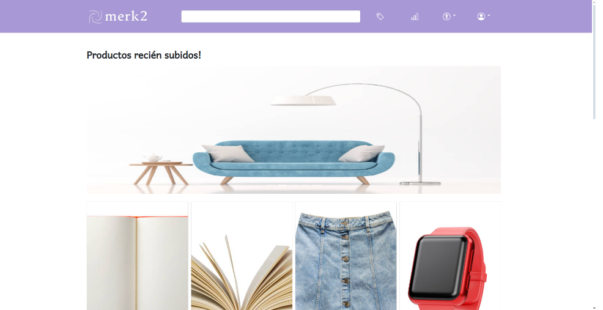
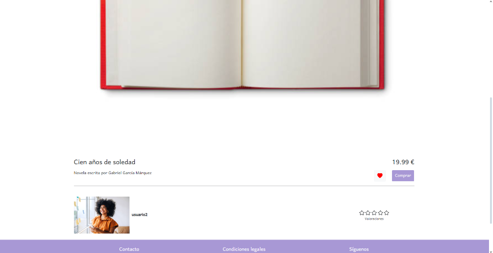
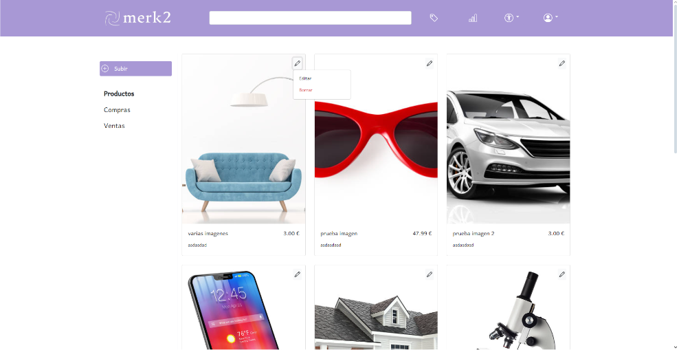

# Proyecto Merk2

## 📖 Descripción del Proyecto

Este es mi **proyecto de fin de grado** para el **Grado Superior en Desarrollo de Aplicaciones Web**, desarrollado de forma independiente. El objetivo del proyecto es crear una **tienda online de productos de segunda mano**, donde los propios usuarios pueden subir sus artículos para la venta. Además, los usuarios pueden interactuar entre sí mediante valoraciones de las compras realizadas y un sistema de ranking opcional que permite identificar a los usuarios que más han contribuido a la aplicación. El proyecto está construido utilizando tecnologías web modernas para garantizar una experiencia de usuario óptima y un rendimiento eficiente.

## 🛠️ Tecnologías Utilizadas

Este proyecto está construido con las siguientes tecnologías:

- **HTML5**: Estructuración del contenido de la aplicación.
- **CSS3**: Estilos visuales personalizados y responsivos.
- **JavaScript**: Lógica y comportamiento dinámico en el frontend.
- **PHP**: Lógica de servidor y comunicación con la base de datos.
- **MySQL**: Almacenamiento y gestión de datos.
- **Bootstrap**: Framework para un diseño web responsive y componentes reutilizables.

## 🚀 Características Principales

- **Registro y Autenticación de Usuarios**: Los usuarios pueden registrarse, iniciar sesión y gestionar su perfil.
- **Subida de Productos**: Los usuarios pueden publicar productos de segunda mano para la venta.
- **Sistema de Valoraciones**: Después de una compra, los usuarios pueden valorar al vendedor, fomentando la confianza y la reputación.
- **Sistema de Ranking**: Muestra qué usuarios han contribuido más a la aplicación mediante la venta y valoración de productos.
- **Sistema de Favoritos**: Permite al usuario guardar productos en favoritos.
- **Interfaz Responsive**: Diseño adaptable a diferentes dispositivos y tamaños de pantalla.
- **Búsqueda y Filtrado**: Permite a los usuarios buscar productos por categoría, precio, ubicación, etc.
- **Panel de Administración**: Gestión de usuarios, productos y valoraciones para administradores.

## 📸 Capturas de pantalla

Aquí puedes ver algunas capturas de pantalla de la aplicación funcionando:

*Página principal de la tienda online.*

*Vista de un producto.*

*Perfil del usuario con sus productos*
